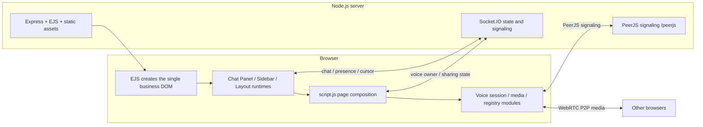

<p align="right"><a href="./README.md">中文</a> | English</p>

# Friends Channel Voice Rooms

A self-hosted fixed-channel voice room for small groups of friends, combining voice, video, screen sharing, channel chat, presence, shared cursors, and a saved free-form layout on one page.

> The project is currently a lightweight personal tool, not a complete meeting platform with accounts, persistent identities, room permissions, or service-level guarantees.

## Features

- Five server-defined channels: `lobby`, `game`, `project`, `screen`, and `idle`; `/` redirects to `/room/lobby`.
- Viewing a channel and joining voice are independent: a single click changes the viewed channel, while a double click requests its voice room.
- Voice join is microphone-first; the camera starts only when the user enables it.
- Microphone mute, camera, screen video and system-audio sharing, output device/volume controls, per-peer volume, and fullscreen viewing.
- Per-channel text chat; the server keeps the latest 50 messages per channel in memory and limits each message to 500 characters.
- Per-channel member presence, microphone/camera/screen status, and full-page shared cursors.
- View, chat, cursor, and voice traffic are channel-isolated; the server validates realtime events against Socket-owned room state.
- A page-level layout that moves real DOM components and supports resize, hide, restore, grid snap, and browser-local persistence.
- Bounded voice-session retries, Socket/Peer recovery, serialized media operations, device-change fallback, and unexpected track-end handling.
- Optional browser-side noise suppression and viewer-side resolution/FPS labels for remote screen shares.

## Componentization Status

| Area                                | Current status                           | Ownership boundary                                                                                                                                                    |
| ----------------------------------- | ---------------------------------------- | --------------------------------------------------------------------------------------------------------------------------------------------------------------------- |
| Chat Panel                          | Code complete; browser retest pending    | `VoiceChatPanelRuntime` solely owns chat business DOM, form state, message rendering, and lifecycle. Its Socket adapter neither creates nor destroys the page Socket. |
| Sidebar                             | Code complete; browser retest pending    | `VoiceSidebarRuntime` solely owns the real channel tree, viewing/voice-target state, and member list. Its presence adapter only subscribes.                           |
| Page Layout                         | Implemented with contract/identity tests | It moves real business nodes instead of cloning or rebuilding fallback shells, and persists layouts per room in `localStorage`.                                       |
| Voice Session / Media               | Modularized with Node behavior tests     | `script.js` remains the page composition owner; session, retry, device, operation, registry, and quality modules have narrow boundaries.                              |
| Stage / Video Grid                  | Not yet a formal component               | It is still jointly managed by page composition and the media registry.                                                                                               |
| Mobile Nav / Media Dock / bootstrap | Not yet formal components                | They remain separate follow-up tasks and are not absorbed by Chat Panel or Sidebar.                                                                                   |

“Code complete; browser retest pending” means static checks and Node behavior/contract tests exist, while real browsers, weak networks, permissions, device unplugging, and deployed environments still need acceptance testing. It does not mean production verification is complete.

## Architecture Overview



The server keeps channel definitions, temporary chat history, and presence in memory. `socket.data` records the current Socket's view/chat/voice owners. A client-provided `roomId` or `peerId` is request data, never a replacement for server ownership.

Media between each participant pair uses two independent one-way send directions:

```text
A -> B: carries only A's currently published media
B -> A: carries only B's currently published media
```

Each direction is owned by its sender. A media change replaces only that sender's direction. These are not duplicate calls, and one PeerJS call does not carry both participants' media. A participant with no live tracks creates no empty media call; when that participant later enables microphone, camera, or screen sharing, it publishes its own direction.

## Tech Stack

- Node.js, Express 5, and EJS
- Socket.IO 4
- PeerJS and WebRTC
- Vanilla JavaScript, CSS, and the Web Audio API
- `@sapphi-red/web-noise-suppressor` and RNNoise WASM
- The Node test runner, ESLint, and Prettier

The browser PeerJS client is currently loaded by the EJS entry through a CDN. PeerServer, Socket.IO, pages, and static assets are served by the same Node service.

## Local Development

Prerequisites: a supported Node.js/npm installation and a modern Chromium-based browser for media testing.

```bash
npm install
cp .env.example .env
npm start
```

On Windows PowerShell:

```powershell
Copy-Item .env.example .env
npm.cmd start
```

The example configuration listens on port `3000`; open <http://localhost:3000>. For automatic development restarts, run:

```bash
npm run dev
```

The repository does not define an `npm test` script. Use the commands in the Testing section.

## Environment Variables

| Variable    | Requirement/default                        | Actual behavior                                                                                                                     |
| ----------- | ------------------------------------------ | ----------------------------------------------------------------------------------------------------------------------------------- |
| `USE_HTTPS` | Required; must be `true` or `false`        | Selects an HTTP or HTTPS Node server. A missing or different value aborts startup.                                                  |
| `PORT`      | Defaults to `443`; the example uses `3000` | Port used by the Node server.                                                                                                       |
| `HOST`      | Defaults to `localhost`                    | Currently used only in the startup-log URL. The code calls `listen(PORT)` and does not use this value to restrict the bind address. |
| `ENV`       | The example uses `dev`                     | Passed to the project Logger; `production` selects production logging and other values use development behavior.                    |

With `USE_HTTPS=true`, the server reads fixed paths `cert/selfsigned.key` and `cert/selfsigned.crt`. For production, it is usually simpler to terminate TLS at Nginx or a hosting panel and keep Node on `USE_HTTPS=false`. The current ICE configuration contains public STUN servers only; there is no TURN environment-variable or credential configuration.

## Production Deployment

Install production dependencies and start one explicitly named PM2 process:

```bash
npm install --omit=dev
pm2 start src/server.js --name replace-with-your-process-name
pm2 save
```

Replace `replace-with-your-process-name` with a real, unique process name, then use that same name for restarts, logs, and monitoring. The production `.env` should explicitly define at least `PORT`, `USE_HTTPS`, and `ENV=production`.

Nginx must use HTTP/1.1 and preserve WebSocket Upgrade headers. The same proxy must cover normal pages, Socket.IO at `/socket.io/`, and PeerJS at `/peerjs/`:

```nginx
location / {
    proxy_pass http://127.0.0.1:3000;
    proxy_http_version 1.1;
    proxy_set_header Upgrade $http_upgrade;
    proxy_set_header Connection "upgrade";
    proxy_set_header Host $host;
    proxy_set_header X-Forwarded-For $proxy_add_x_forwarded_for;
    proxy_set_header X-Forwarded-Proto $scheme;
}
```

- Restart PM2 after changes to `src/server.js`, `src/utils/`, realtime protocols, server-rendered entry EJS, or dependencies.
- Pure frontend JS/CSS served statically by Express normally does not require a Node restart, but browsers should be force-refreshed to discard old cached assets.
- HTTPS is required for camera, microphone, and screen capture outside localhost secure-context exceptions.
- After deployment, verify Upgrade behavior for both `/socket.io/` and `/peerjs/`. An `Invalid frame header` usually needs a separate audit of the Nginx/hosting-panel WebSocket proxy chain.

## Testing

Run all Node behavior and contract tests:

```bash
node --test tests/*.mjs
```

Run static checks:

```bash
npm run eslint
node --check src/server.js
node --check src/views/script.js
npx prettier README.md README.en.md --check
git diff --check
```

The suite covers voice protocol/negotiation, the peer registry, session recovery, media quality, server trust and disconnect lifecycles, view/chat room lifecycle, page-layout identity, and Chat Panel/Sidebar lifecycles. These are Node model and contract tests, not browser E2E tests.

Real acceptance should use at least two independent browser contexts and cover two-way microphones, late media enablement, camera/screen switching, system audio, join/leave/refresh, network reconnection, permission denial, device unplugging, channel isolation, chat, shared cursors, and layout recovery.

## Debugging

Media diagnostics are off by default. Persistently enable them for later page loads from the console:

```js
localStorage.setItem('voiceMediaDebug', '1');
```

Alternatively, add `?voiceMediaDebug=1` to one URL. After reproducing the issue, export the bounded records in the console:

```js
exportVoiceMediaDebug();
```

The log keeps at most 300 summaries with session, retry, direction, generation, media-kind, and connection-state fields. It excludes full SDP, ICE candidates, IP addresses, track IDs, device labels, and full nicknames. Screen-share quality logs also exclude full peer IDs, SSRCs, and unbounded history. Still review and minimize context before sharing an export.

When investigating a Socket listener warning in production, first restart the new code and separate or clear old PM2 logs before reproducing it. If a fresh `MaxListenersExceededWarning` remains, capture a new `--trace-warnings` stack. Do not hide an ownership problem by raising the listener limit.

## Known Limitations

- WebRTC uses a P2P mesh. Uplink bandwidth, connection count, and CPU cost increase for every participant.
- Only public STUN is configured; without TURN, restrictive NATs, enterprise/campus networks, or firewalls may prevent media connections.
- There are no accounts, login, persistent identities, permissions, or room administration. A display name is not a trusted identity.
- Presence, channel chat history, and related server state are in memory and disappear on restart.
- A deployed Socket.IO WebSocket has produced `Invalid frame header`. The client can fall back to polling, but the proxy/Upgrade root cause still needs a separate diagnosis.
- There is no automated real-browser E2E suite. Current automation is primarily Node behavior, model, and source-contract testing.
- Voice Session Resilience, permission/device recovery, Chat Panel, Sidebar, and the screen-share quality label still need more real-browser, weak-network, and device-unplug testing.
- Mobile Nav is not yet a formal component. Stage / Video Grid, Media Dock, and the script loader/bootstrap are also pending consolidation.
- Production dependencies still have high/moderate vulnerabilities that require a separate upgrade and full regression pass.
- Third-party CDN/self-hosting policy, security headers, CSS/z-index cleanup, legacy layout components, and duplicate popover ownership remain open work.

See the continuously maintained [Architecture Repair Backlog](./docs/architecture-repair-backlog.md) for the full status.

## Security Boundaries

- Server-side `socket.data` determines realtime room and peer ownership. Client payloads are not authentication facts.
- Chat Panel and Sidebar write dynamic names, status text, and chat content with `textContent`; user text is not executed as HTML.
- The server bounds display names and chat content and rejects chat for a room different from the Socket owner. This is not an account authentication, authorization, audit, or abuse-prevention system.
- The project has no account system. Anyone who can reach the deployment may be able to enter its fixed channels; public deployments should add access control at the reverse-proxy or network layer.
- Debug logs deliberately exclude full SDP, candidates, IPs, track IDs, device labels, and full nicknames, but exported files should still be handled as sensitive diagnostics.
- CDN dependencies and the missing unified security-header baseline are risks to address before public deployment.
- Report security issues through the GitHub repository's private vulnerability-reporting feature. Do not post credentials, IPs, raw SDP/logs, or sensitive deployment reproduction details in a public Issue.

## Documentation

- [Frontend modules and loading order](./docs/view-js-modules.md)
- [Voice Media Call protocol](./docs/voice-call-protocol.md)
- [Voice Session state machine](./docs/voice-session-state-machine.md)
- [Media permissions, devices, and error recovery](./docs/voice-media-error-recovery.md)
- [Server Socket disconnect lifecycle](./docs/server-socket-lifecycle.md)
- [Chat Panel component boundary](./docs/chat-panel-component.md)
- [Sidebar component boundary](./docs/sidebar-component.md)
- [Page layout contract and recovery tests](./tests/page_layout_contract_test.mjs)
- [Architecture Repair Backlog](./docs/architecture-repair-backlog.md)

## License

[ISC License](./LICENSE) — Copyright (c) 2026 EliYork.
