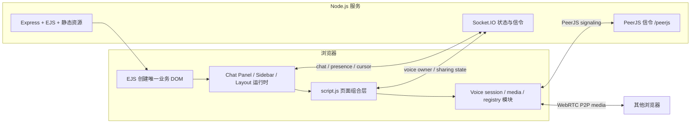

<p align="right">中文 | <a href="./README.en.md">English</a></p>

# 朋友频道语音房间

一个面向朋友小群体的自托管固定频道语音房间：在同一页面中提供语音、视频、屏幕共享、频道聊天、在线状态、共享鼠标与可保存的自由布局。

> 当前定位是轻量自用工具，不是带账号、持久化身份、房间权限或服务等级承诺的完整会议平台。

## 功能特性

- 五个服务端固定频道：`lobby`、`game`、`project`、`screen`、`idle`；访问 `/` 会跳转到 `/room/lobby`。
- 浏览频道与加入语音相互独立：单击切换所查看的频道，双击频道请求加入对应语音房间。
- 加入语音时优先请求麦克风；摄像头由用户按需开启。
- 支持麦克风静音、摄像头、屏幕画面与系统音频共享、输出设备/音量控制、远端音量和全屏观看；开始屏幕共享前可选择自动、720p、1080p、1440p 或原始分辨率，以及 15/30/60 fps 目标值。
- 同频道文字聊天；服务端在内存中保存每个频道最近 50 条消息，每条消息最多 500 个字符。
- 同频道在线成员、麦克风/摄像头/屏幕共享状态和全页面共享鼠标。
- 浏览、聊天、共享鼠标和语音均按频道隔离；服务端以 Socket 所拥有的房间状态校验实时事件。
- 页面级布局支持真实 DOM 组件的移动、缩放、隐藏、恢复、网格吸附和浏览器本地保存。
- 语音会话包含有限重试、Socket/Peer 恢复、媒体操作串行化、设备变化回退和意外 track 结束处理。
- 可选的浏览器端降噪和接收端屏幕共享分辨率/FPS 标签。

## 组件化现状

| 区域 | 当前状态 | 所有权边界 |
| --- | --- | --- |
| Chat Panel | 代码完成，待浏览器复测 | `VoiceChatPanelRuntime` 单独拥有聊天业务 DOM、表单状态、消息渲染和生命周期；Socket 适配器不创建或销毁页面 Socket。 |
| Sidebar | 代码完成，待浏览器复测 | `VoiceSidebarRuntime` 单独拥有真实频道树、浏览/语音目标状态和成员列表；presence 适配器只负责订阅。 |
| Page Layout | 已实现并有合同/identity 测试 | 移动真实业务节点，不克隆或用备用 shell 重建；布局按房间保存在 `localStorage`。 |
| Voice Session / Media | 已模块化并有 Node 行为测试 | `script.js` 仍是页面 composition owner；session、retry、device、operation、registry 和 quality 模块各自维护窄边界。 |
| Media Dock | 代码完成，待浏览器复测 | `VoiceMediaDockRuntime` 单独拥有真实 Dock DOM、媒体按钮、设备/音量 UI、状态与 listener 生命周期；窄 adapter 只转发意图和 snapshot。 |
| Stage / Video Grid | 尚未正式组件化 | 仍由页面 composition 与媒体 registry 协作管理。 |
| Mobile Nav / bootstrap | 尚未正式组件化 | 保留为后续独立任务；Stage / Video Grid 也未被 Media Dock 越界接管。 |

“代码完成，待浏览器复测”表示静态检查和 Node 行为/合同测试已覆盖，但真实浏览器、弱网、权限、设备拔插或部署环境仍需要验收；它不等同于生产验证完成。

## 架构概览



服务端把频道定义、临时聊天历史和 presence 保存在内存中。`socket.data` 保存当前 Socket 的 view/chat/voice owner；客户端提交的 `roomId` 或 `peerId` 只是请求数据，不能替代服务端所有权。

每对参与者的媒体是两个独立的单向发送方向：

```text
A -> B：只携带 A 当前发布的媒体
B -> A：只携带 B 当前发布的媒体
```

两条方向分别由各自发送方拥有，某一方的媒体改变时只替换自己的发送方向。它们不是重复呼叫，也不是一条 PeerJS call 同时承载双方媒体。没有 live track 的一方不会创建空媒体 call；稍后开启麦克风、摄像头或屏幕时，再发布自己的方向。

## 技术栈

- Node.js、Express 5、EJS
- Socket.IO 4
- PeerJS / WebRTC
- 原生 JavaScript、CSS、Web Audio API
- `@sapphi-red/web-noise-suppressor` 与 RNNoise WASM
- Node 内置 test runner、ESLint、Prettier

浏览器端 PeerJS 当前由 EJS 入口通过 CDN 加载；PeerServer、Socket.IO、页面和静态资源由同一个 Node 服务提供。

## 本地运行

要求：安装受支持的 Node.js/npm，并使用现代 Chromium 系浏览器进行媒体测试。

```bash
npm install
cp .env.example .env
npm start
```

Windows PowerShell 可使用：

```powershell
Copy-Item .env.example .env
npm.cmd start
```

默认示例配置监听端口 `3000`，打开 <http://localhost:3000>。开发时需要自动重启可运行：

```bash
npm run dev
```

仓库没有定义 `npm test` 脚本；测试命令见下文。

## 环境变量

| 变量 | 必需/默认值 | 实际作用 |
| --- | --- | --- |
| `USE_HTTPS` | 必需，必须是 `true` 或 `false` | 决定 Node 创建 HTTP 还是 HTTPS 服务；缺失或其他值会直接启动失败。 |
| `PORT` | 默认 `443`；示例为 `3000` | Node 服务监听端口。 |
| `HOST` | 默认 `localhost` | 目前只用于启动日志中的 URL；代码调用 `listen(PORT)`，不会用它限制绑定地址。 |
| `ENV` | 示例为 `dev` | 传给项目 Logger；`production` 使用生产日志格式，其余值按开发模式处理。 |

当 `USE_HTTPS=true` 时，服务端固定读取 `cert/selfsigned.key` 与 `cert/selfsigned.crt`。生产环境更推荐由 Nginx/宝塔终止 TLS，并让 Node 使用 `USE_HTTPS=false`。当前 ICE 配置只有公共 STUN，没有 TURN 环境变量或 TURN 凭据配置。

## 生产部署

只安装生产依赖并启动一个明确命名的 PM2 进程：

```bash
npm install --omit=dev
pm2 start src/server.js --name replace-with-your-process-name
pm2 save
```

请把 `replace-with-your-process-name` 替换成你的真实、唯一进程名，后续 `restart`、日志与监控都使用该名称。`.env` 至少应明确设置 `PORT`、`USE_HTTPS` 和 `ENV=production`。

Nginx 必须使用 HTTP/1.1 并保留 WebSocket Upgrade；同一反代应覆盖普通页面、Socket.IO 的 `/socket.io/` 和 PeerJS 的 `/peerjs/`：

```nginx
location / {
    proxy_pass http://127.0.0.1:3000;
    proxy_http_version 1.1;
    proxy_set_header Upgrade $http_upgrade;
    proxy_set_header Connection "upgrade";
    proxy_set_header Host $host;
    proxy_set_header X-Forwarded-For $proxy_add_x_forwarded_for;
    proxy_set_header X-Forwarded-Proto $scheme;
}
```

- 对 `src/server.js`、`src/utils/`、实时协议、服务端渲染入口 EJS 或依赖的修改，部署后重启 PM2。
- 只修改由 Express 静态提供的前端 JS/CSS 时通常不需要重启 Node，但浏览器应强制刷新并清理旧缓存。
- HTTPS 是摄像头、麦克风和屏幕共享在非 localhost 环境正常工作的必要前提。
- 部署后应真实验证 `/socket.io/` 与 `/peerjs/` 的 Upgrade；`Invalid frame header` 通常需要单独排查 Nginx/宝塔的 WebSocket 转发链路。

## 测试

运行全部 Node 行为与合同测试：

```bash
node --test tests/*.mjs
```

运行静态检查：

```bash
npm run eslint
node --check src/server.js
node --check src/views/script.js
npx prettier README.md README.en.md --check
git diff --check
```

测试覆盖 voice 协议/协商、peer registry、会话恢复、媒体质量、服务端信任边界与 disconnect 生命周期、view/chat room 生命周期、页面布局 identity，以及 Chat Panel、Sidebar、Media Dock 生命周期和屏幕共享目标约束。它们是 Node 模型与合同测试，不是浏览器 E2E。

真实验收至少应使用两个独立浏览器上下文，检查双向麦克风、后开媒体、摄像头与屏幕切换、系统音频、加入/离开/刷新、断网重连、权限拒绝、设备拔插、频道隔离、聊天、共享鼠标和布局恢复。

## 调试

媒体诊断默认关闭。可在控制台为后续页面持久开启：

```js
localStorage.setItem("voiceMediaDebug", "1");
```

也可只为当前 URL 添加 `?voiceMediaDebug=1`。复现后在控制台导出有界记录：

```js
exportVoiceMediaDebug();
```

日志最多保留 300 条摘要，包含会话、重试、方向、generation、媒体 kind 和连接状态等诊断字段。它不会记录完整 SDP、ICE candidate、IP、track ID、设备 label 或完整昵称；屏幕共享质量日志也不会记录完整 peer ID、SSRC 或无界历史。分享调试结果前仍应检查并最小化上下文。

生产环境排查 Socket listener 警告时，应先重启新代码并清理/区分旧 PM2 日志，再复现。如果新日志仍出现 `MaxListenersExceededWarning`，使用 `--trace-warnings` 获取新堆栈；不要通过提高 listener 上限隐藏所有权问题。

## 已知限制

- WebRTC 使用 P2P mesh；参与者越多，每个浏览器的上行带宽、连接数和 CPU 压力越大。
- 目前只有公共 STUN，没有 TURN；严格 NAT、企业网、校园网或受限防火墙下可能无法建立媒体连接。
- 没有账号、登录、持久身份、权限或房间管理；显示名不是可信身份。
- presence、频道聊天历史和相关服务端状态只存在内存中，服务重启即丢失。
- 线上 Socket.IO WebSocket 曾出现 `Invalid frame header`，业务端可回退 polling，但代理/Upgrade 根因尚未完成独立诊断。
- 没有真实浏览器自动 E2E；当前自动化主要是 Node 行为、模型和源码合同测试。
- Voice Session Resilience、权限/设备错误恢复、Chat Panel、Sidebar、Media Dock、屏幕共享选择和质量标签仍需要更多真实浏览器、弱网与设备拔插复测。
- Mobile Nav 尚未正式组件化；Stage / Video Grid 和 script loader/bootstrap 也仍待收敛。
- 生产依赖仍有待单独处理的 high/moderate 漏洞，升级前后需要完整回归。
- 第三方 CDN、自托管资源策略、安全 header、CSS/z-index、旧布局组件和重复 popover owner 仍待整理。

完整、持续更新的状态见[架构修复待办](./docs/architecture-repair-backlog.md)。

## 安全边界

- 实时事件的房间与 peer 所有权由服务端 `socket.data` 决定；客户端 payload 不是认证事实。
- Chat Panel 与 Sidebar 的动态昵称、状态和聊天正文通过 `textContent` 写入，不把用户文本当 HTML 执行。
- 服务端会限制显示名和聊天正文长度并拒绝跨 owner room 的聊天；这不等同于账号认证、授权、审计或反滥用系统。
- 项目没有账号系统，任何人只要能访问部署地址就可能加入固定频道；公开部署应在反向代理或网络层增加访问控制。
- 调试日志刻意排除完整 SDP、candidate、IP、track ID、设备 label 和完整昵称，但导出文件仍应按敏感诊断数据处理。
- 依赖 CDN 与当前缺少统一安全 header 基线是公开部署前需要处理的风险。
- 安全问题请通过 GitHub 仓库的私密漏洞报告功能联系维护者，不要在公开 Issue 中发布凭据、IP、SDP、日志原文或可复现的敏感部署信息。

## 文档导航

- [前端模块与加载顺序](./docs/view-js-modules.md)
- [Voice Media Call 协议](./docs/voice-call-protocol.md)
- [Voice Session 状态机](./docs/voice-session-state-machine.md)
- [媒体权限、设备与错误恢复](./docs/voice-media-error-recovery.md)
- [服务端 Socket disconnect 生命周期](./docs/server-socket-lifecycle.md)
- [Chat Panel 组件边界](./docs/chat-panel-component.md)
- [Sidebar 组件边界](./docs/sidebar-component.md)
- [页面布局合同与恢复测试](./tests/page_layout_contract_test.mjs)
- [架构修复待办](./docs/architecture-repair-backlog.md)

## 特别感谢 / Credits

本项目在开发过程中参考和学习了以下开源项目，感谢这些项目作者的分享：

| 项目 | 参考内容 | 协议 |
| --- | --- | --- |
| [nlukic97/WebRTC-video-chat](https://github.com/nlukic97/WebRTC-video-chat) | 视频通话、WebRTC / PeerJS、屏幕共享相关实现思路 | ISC |
| [nlukic97/WebSocket-Cursor-Room](https://github.com/nlukic97/WebSocket-Cursor-Room) | 多用户鼠标位置同步 / 共享鼠标思路 | MIT |
| [sapphi-red/web-noise-suppressor](https://github.com/sapphi-red/web-noise-suppressor) | Web Audio API 降噪节点与降噪方案参考 | MIT |

以上项目仍归原作者所有，并遵循各自仓库中的开源协议。本项目自己的协议见下方 License。

## License

[ISC License](./LICENSE) — Copyright (c) 2026 EliYork.
